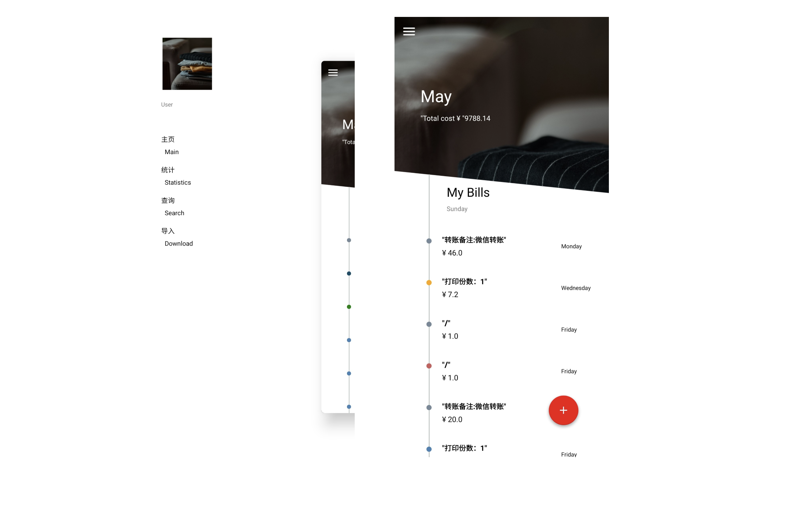

# Bill Manager

本Ap针对无法统一支付宝账单和微信账单的问题，设计并实现了一款可以结合支付宝账单和 微信账单的 APP。使用者可以通过该 APP 导入微信和支付宝的账单，并生成专属于个人的消 费报告，主要包含食物，娱乐，衣物，交通等各个方面的消费信息。然后使用者可以进行自由上传、 搜索、删除个人账单等操作，以此实现对个人账单的统一管理。此外，通过消费报告还可以分析使 用者的消费习惯。本课题解决了目前无法对来自于不同 APP 的电子账单进行统一管理的问题，为使 用者提供了便捷、高效的个人账单管理平台。

## 主要页面

## 颜色获取

通过更换主页面的图片来获取图片的主题颜色并适配应用primary color 与 secondary color

在应用中用到三种颜色ColorPrimary、ColorSecondary与ColorAccent，要获取这三种颜色需要用户导入图片，把图片的主体颜色分析出来并根据主体颜色获取ColorSecondary和ColorAccent。

应用中所使用的颜色从图片里获取，用户可以在目录Fragment中选择背景图片，选择图片借助系统自带的图片选择器MediaStore。用户选择完图片，把地址保存到SharedPreference里，图片可以在主Fragment的背景图中使用。

图片是由红绿蓝为基础的颜色点矩阵组成，获取图片的高度和宽度以后，用两层循环遍历矩阵，获取每个点的颜色值，记录出现次数，把这两个值保存到Map里，遍历完成后排序该Map容器。在这里过滤掉白色和黑色，值为最高的颜色设置为ColorPrimary。

这里用到RGB与HSL两种数据类型，要获取这两种颜色要改ColorPrimary的HSL值，因为获取到的ColorPrimary是Color类型的，要转换HSL值后改变颜色色相和饱和度后得到ColorSecondary和ColorAccent。Color 可以很容易转换RGB值，RGB转HSL需要下列公式：

把原有的R、G、B 值换为0~1的值，

获取最大值和最小值，

计算最大值与最小值之间的差，

计算Hue，

计算Saturation，

计算Lightweight。

获取HSL对象之后将饱和度设置为原来的7/5或1/5后得到ColorSecondary。

ColorAccent的选择上MaterialDesign没有给出明确的计算方法，只提供一些参考配色方案，ColorAccent有突出细节及强调作用，选择与ColorPrimary饱和度相反或互补且以前未定义过的颜色，在项目中用到的选择方案是跟ColorPrimary的色相相反的颜色。在Adobe color中可以发现多种配色方案。